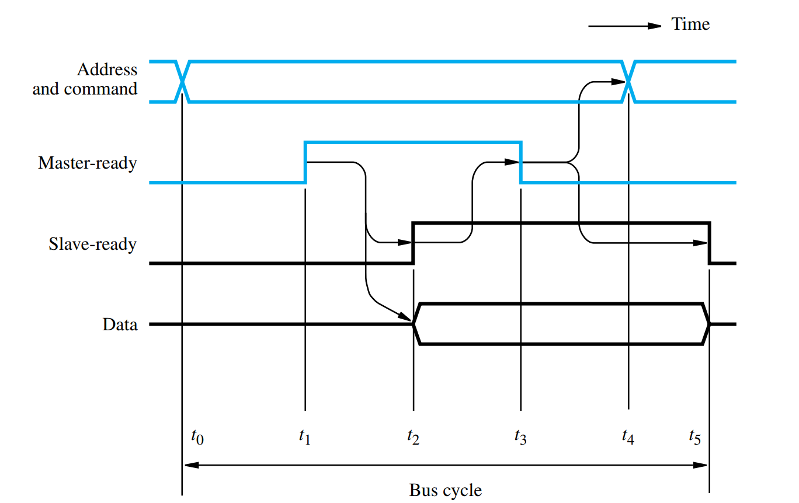

# electronics-FPGA-libs
Common libraries and modules for FPGA

# SPI Module

## Slave Module

The SPI Slave module uses a handshake system in order to safely cross between OBC and FPGA clock domains as seen below: 

To us the module the following inputs and outputs should be configured as below:

OBS! Here (external) means that the signal needs to go to OBC and (Internal) is used strictly inside the FPGA.

<mark>i_clock</mark>: Input clock from master, is used to synchronize data inn/out from slave to master (external)

<mark>MOSI</mark>: Serial input from master (external)

<mark>MISO_Data_To_Master</mark>: Register with data to be serialized and sendt to master. Needs to have a value before transaction is started. (internal)

<mark>SC</mark>: Slave select. Input to signal that the module must be ready for data transfer, OBC to FPGA (external).

<mark>MISO_send_enable</mark>: Toggle for singling the SPI module to start sending data. (internal)

<mark>MISO</mark>: Serial output to master (external)

<mark>MOSI_Data_To_FPGA</mark>: Register containing data recieved from OBC (internal)

<mark>msg_r</mark>: Signals that a message has been received (internal)

<mark>msg_s</mark>: Signals that a message has been sendt (internal)